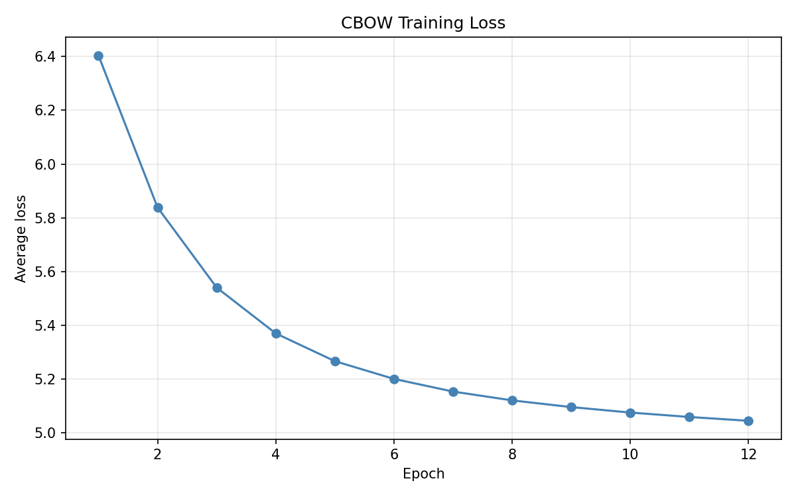
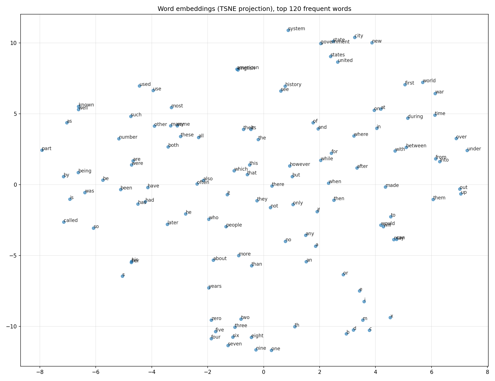
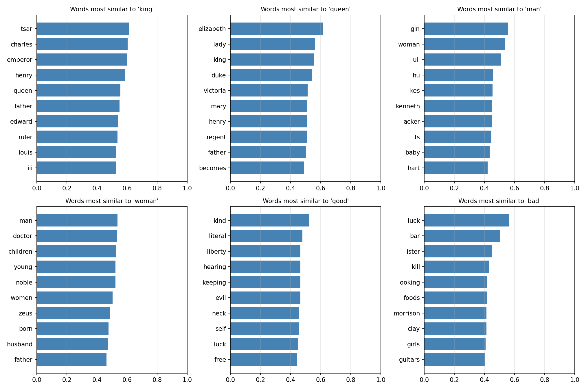
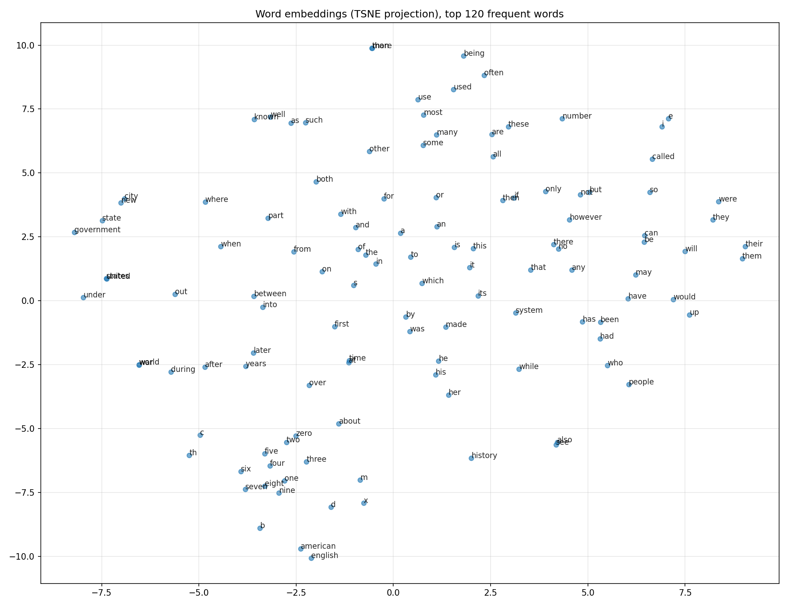

# Word2Vec from Scratch — CBOW, Skip-gram & Negative Sampling (PyTorch)

A complete, from-scratch implementation of **Word2Vec** in PyTorch covering the
three classic training setups — **CBOW**, **Skip-gram**, and **Skip-gram with
Negative Sampling** — built on a custom **BPE subword tokenizer** that
eliminates the out-of-vocabulary (OOV) problem.

Every script is self-contained, runs on a single machine, cloud VM, Colab,
Kaggle, or Jupyter, and ships with `tqdm` progress bars, similar-word analysis,
word2vec-style analogies, and visualization graphs.

---

## Table of Contents

1. [Overview](#overview)
2. [Models Implemented](#models-implemented)
3. [Features](#features)
4. [Project Structure](#project-structure)
5. [Requirements](#requirements)
6. [Quick Start](#quick-start)
7. [How Each Model Works](#how-each-model-works)
8. [BPE Tokenizer (No OOV)](#bpe-tokenizer-no-oov)
9. [Configuration](#configuration)
10. [The Pipeline Step by Step](#the-pipeline-step-by-step)
11. [Outputs & Visualization Gallery](#outputs--visualization-gallery)
12. [Sample Results (Artifacts)](#sample-results-artifacts)
13. [Using a Custom Corpus](#using-a-custom-corpus)
14. [Notes & Troubleshooting](#notes--troubleshooting)
15. [References](#references)
16. [License](#license)

---

## Overview

Word2Vec learns **dense vector representations of words** such that words
appearing in similar contexts end up close in vector space. The famous outcome:
`vector("king") - vector("man") + vector("woman") ≈ vector("queen")`.

This repository implements the whole stack from first principles:

- a **BPE tokenizer** written in pure standard-library Python (no external
  tokenizer packages),
- three **model architectures** (`nn.Linear`-based one-hot models and
  `nn.Embedding`-based negative sampling),
- a complete **training pipeline** with progress bars, checkpointing, and
  evaluation, and
- **visualization tools** (loss curves, t-SNE/PCA projections, heatmaps,
  similarity bar charts).

---

## Models Implemented

| Model | Script | Architecture | Objective |
|---|---|---|---|
| **CBOW** | `train.py` | one-hot context `(ctx, V)` → `Linear(V, E)` → `mean` → `Linear(E, V)` | `CrossEntropyLoss` over the full vocab |
| **Skip-gram** | `train_skipgram.py` | one-hot center `(V,)` → `Linear(V, E)` → `Linear(E, V)` | `CrossEntropyLoss` over the full vocab |
| **Skip-gram + Negative Sampling** | `train_negative_sampling.py` | id-based: `Embedding(V, E)` × 2 | `-log σ(pos) - Σ log σ(-neg)` |

All three share the same corpus loader, tokenizer, analysis and plotting code,
so results are directly comparable.

---

## Features

- **No OOV problem** — BPE subword tokenizer splits unseen words into known
  subword tokens (down to single characters).
- **Automatic corpus handling** — uses a local `corpus.txt` if present, else
  downloads **text8** (17M words), else falls back to a built-in sample corpus.
- **Cloud-friendly** — `matplotlib` forced to `Agg`, tqdm bars adapt to
  Jupyter/Colab/Kaggle vs terminal vs piped logs.
- **Progress bars** — one clean progress bar per epoch with live loss (no spam
  in notebooks or logs).
- **Similar-word analysis** — cosine similarity on averaged + normalized
  embeddings.
- **Word2vec analogies** — e.g. `king - man + woman ≈ queen`.
- **Vector inspection** — raw embedding vectors printed for any word.
- **Visualization** — loss curve, t-SNE/PCA projection, embedding heatmap,
  similarity heatmap, similarity bar charts.
- **Model & embedding export** — PyTorch checkpoints + `embeddings.npy/.csv`.
- **Reproducible** — seeded sampling, shuffling, and BPE training.

---

## Project Structure

```
word2vec/
├── train.py                        # CBOW training pipeline
├── train_skipgram.py               # Skip-gram training pipeline
├── train_negative_sampling.py      # Skip-gram + Negative Sampling pipeline
│
├── BPE_Tokenizer.py                # BPE subword tokenizer (stdlib only, no OOV)
├── CBOW_model.py                   # CBOW network (two Linear layers)
├── CBOW_Data.py                    # CBOW dataset (one-hot, built lazily)
├── SKIP_GRAM_Model.py              # Skip-gram network (two Linear layers)
├── SKIP_GRAM_Data.py               # Skip-gram dataset (one sample per neighbor)
├── Negative_Sampling_model.py      # Embedding-based negative-sampling model
├── Negative_Sampling_Data.py       # id-based dataset + unigram^0.75 sampler
│
├── outputs/                        # CBOW run artifacts (gitignored)
├── outputs_skipgram/               # Skip-gram run artifacts (gitignored)
├── outputs_ns/                     # Negative-sampling run artifacts (gitignored)
├── artifacts/
│   ├── CBOW/                       # sample CBOW run images (committed)
│   └── SKIP_GRAm/                  # sample Skip-gram run images (committed)
│
├── cbow_model.pt                   # saved CBOW checkpoint (gitignored)
├── skipgram_model.pt               # saved Skip-gram checkpoint (gitignored)
├── negative_sampling_model.pt      # saved NS checkpoint (gitignored)
├── text8 / corpus.txt              # optional corpus files (gitignored)
├── README.md
└── .gitignore
```

> The three training scripts import shared analysis/plot helpers from
> `train.py`, so keep all files in the same directory.

---

## Requirements

```
torch
tqdm
matplotlib
scikit-learn      (optional — skipped if not installed; a PCA fallback is built in)
```

Python **3.8+** recommended. No tokenizer package is needed — the BPE
tokenizer uses only the standard library.

```bash
pip install torch tqdm matplotlib scikit-learn
```

---

## Quick Start

```bash
# 1. Continuous Bag-of-Words
python train.py

# 2. Skip-gram
python train_skipgram.py

# 3. Skip-gram with Negative Sampling
python train_negative_sampling.py
```

Each script will:

1. Load the corpus — `corpus.txt` if present, else download `text8`, else use
   the built-in sample corpus.
2. Train the BPE tokenizer on the corpus.
3. Train the model with progress bars.
4. Print most similar words, raw vectors, and analogies.
5. Save plots, model checkpoint, and embeddings.

| Run | Model output | Plots directory | Checkpoint |
|---|---|---|---|
| `train.py` | `outputs/` | `outputs/` | `cbow_model.pt` |
| `train_skipgram.py` | `outputs_skipgram/` | `outputs_skipgram/` | `skipgram_model.pt` |
| `train_negative_sampling.py` | `outputs_ns/` | `outputs_ns/` | `negative_sampling_model.pt` |

---

## How Each Model Works

### 1. CBOW (`CBOW_model.py`, `CBOW_Data.py`)

CBOW predicts the **center word** from its **context window**:

```
  context one-hot (ctx, V)
        │
        ▼
  W : Linear(V, E)  ──►  (ctx, E)   # per-word "lookup"
        │
        ▼
  torch.mean(dim=1)  ──►  (E,)      # bag-of-words average
        │
        ▼
  W_dash : Linear(E, V)  ──►  logits (V,)
        │
        ▼
  CrossEntropyLoss(logits, target_id)
```

Because the input is one-hot, `W` acts exactly like an embedding lookup — its
rows *are* the word vectors.

> **Note:** `nn.Linear` stores weights as `(out_features, in_features)`, so
> `W.weight` is `(E, V)` and must be **transposed** to `(V, E)` before
> averaging with `W_dash.weight` (already `(V, E)`). See
> `get_embedding_matrix()`.

Final vectors are the **average of input + output weights**, L2-normalized for
cosine similarity.

### 2. Skip-gram (`SKIP_GRAM_Model.py`, `SKIP_GRAM_Data.py`)

Skip-gram reverses the CBOW task: given the **center word**, predict the words
in its context window. The dataset emits **one sample per window neighbor**
(`center → context`), so a center word appears `2 × context_size` times.

```
  center one-hot (V,)
        │
        ▼
  W : Linear(V, E)  ──►  (E,)
        │
        ▼
  W_dash : Linear(E, V)  ──►  logits (V,)
        │
        ▼
  CrossEntropyLoss(logits, ONE context word)
```

### 3. Skip-gram + Negative Sampling (`Negative_Sampling_model.py`,
   `Negative_Sampling_Data.py`)

Full-softmax over a 10k vocab is slow. Negative sampling replaces it with
binary classification: score the **one true context word** high and **K random
"noise" words** low.

- Dataset returns raw **token ids** (no one-hot) — the model uses two
  `nn.Embedding` layers, so it is far cheaper in memory and time.
- Negatives are drawn from the **unigram distribution ^ 0.75**
  (`freq(w)^0.75 / Σ`), the standard word2vec trick that gives rare words a
  fairer chance of being sampled.

```
  emb1 : Embedding(V, E)   center/input vectors
  emb2 : Embedding(V, E)   context/output vectors

  pos_score  = emb1(center) · emb2(context)
  neg_scores = emb1(center) · emb2(neg_1 ... neg_K)

  loss = -log σ(pos) - mean(log σ(-neg))
```

---

## BPE Tokenizer (No OOV)

`BPE_Tokenizer.py` learns subword merge rules on the corpus, so **any word —
even one never seen during training — is encoded** into known subword units,
down to single characters if necessary.

**Training:**

1. Pre-tokenize the corpus into lowercase word tokens.
2. Build the token frequency table.
3. Initial vocabulary: `<PAD>`, `<UNK>`, plus all unique characters.
4. Iteratively merge the most frequent adjacent symbol pair into a new token
   (priority-queue based, lazy deletions — fast even on large corpora) until
   the target `vocab_size` is reached.
   Merges are learned only from the most frequent words
   (`max_unique_words`, `min_freq`), bounding training time.

**Encoding:** a greedy pass that always merges the adjacent pair with the
**lowest merge rank** (the pair merged earliest during training), reproducing
the exact segmentation of seen words and a sensible segmentation for unseen
ones.

The tokenizer mirrors the API the datasets expect:

```python
tokenizer.encode(text, add_special_tokens=True, truncation=True, max_length=128)
tokenizer.vocab_size          # len(tokenizer.stoi)
tokenizer.stoi / tokenizer.itos
tokenizer.frequent_words      # used by analysis and plots
```

---

## Configuration

Each script has a `CONFIG` dict at the top. The common knobs:

| Key | Default | Description |
|---|---|---|
| `emb_size` | `100` | embedding dimension |
| `context_size` | `2` | words on each side of the target/center |
| `max_length` | `256` | max tokens per training chunk |
| `vocab_size` | `10000` | target BPE vocab size |
| `batch_size` | `64` (NS: `256`) | batches per step |
| `epochs` | `12` (SG/NS: `15`) | number of training epochs |
| `lr` | `0.001` (NS: `0.002`) | Adam learning rate |
| `seed` | `42` | reproducibility seed |
| `max_corpus_words` | `150_000_000` | cap words used from the corpus (text8 ≈ 17M) |
| `max_pairs` | `2_000_000` | cap training pairs (early-stop, sampled across the corpus) |
| `num_negatives` | `5` | K noise samples per pair (negative sampling only) |
| `device` | auto | `cuda` if available, else `cpu` |
| `data_url` | `mattmahoney.net/.../text8.zip` | corpus download URL |
| `out_dir` | per-script | where plots/embeddings go |

Example:

```python
CONFIG = {
    "emb_size": 128,
    "vocab_size": 20000,
    "epochs": 25,
    "num_negatives": 10,
}
```

---

## The Pipeline Step by Step

1. **Load corpus** — `corpus.txt` → `text8` download → built-in sample.
2. **Chunk** the text into `max_length/2`-token chunks.
3. **Train the BPE tokenizer** on the chunks.
4. **Build the dataset** —
   - CBOW: one `(context window, target)` per position, one-hot built lazily.
   - Skip-gram: one `(center, context)` per window neighbor.
   - NS: same pairs, but token ids only (no one-hot).
   With `max_pairs`, chunks are shuffled first and pair-building stops early.
5. **Train** with `tqdm` progress bars (one bar per epoch, live loss) and Adam.
6. **Extract embeddings** — average input + output weights, L2-normalize.
7. **Analyze** — most similar words, raw vectors, analogies.
8. **Visualize** — loss curve, 2D projection, heatmaps, similarity bars.

---

## Outputs & Visualization Gallery

| File (in each `outputs*` dir) | Contents |
|---|---|
| `training_loss.png` | average per-epoch loss curve |
| `embeddings_tsne.png` / `embeddings_pca.png` | 2D projection (t-SNE if available, else SVD-PCA) of the most frequent words |
| `embedding_heatmap.png` | "image" of the vectors — one row per word, one column per dimension |
| `similarity_heatmap.png` | pairwise cosine similarity between query words |
| `similarity_bars.png` | horizontal bar charts of the top-10 similar words per query |
| `embeddings.csv` / `embeddings.npy` | full `(vocab × emb)` matrix for reuse |

Console output during/after training:

```
MOST SIMILAR WORDS (cosine similarity on learned embeddings)
  king -> queen (0.87), kingdom (0.71), royal (0.62) ...

Word2vec-style analogies
  king - man + woman ~= queen (sim 0.42)
```

---

## Sample Results (Artifacts)

Example outputs from actual runs are committed under [`artifacts/`](artifacts/).
The `artifacts/CBOW/` folder shows CBOW results; `artifacts/SKIP_GRAm/` shows
Skip-gram results.

### CBOW — training loss



The loss curve shows the model converging over epochs.

### CBOW — word embedding projection (t-SNE)



Each point is a word projected to 2D with t-SNE; words with similar meanings
cluster together.

### CBOW — similar words (bar charts)



Top-10 most similar words for a set of query words, ranked by cosine
similarity.

### CBOW — alternate t-SNE view


### CBOW — console output (screenshot)


Example of the script's console output: similar words, analogies, and vector
prints.

### Skip-gram — word embedding projection (t-SNE)



---

## Using a Custom Corpus

Drop a plain text file named `corpus.txt` in the project directory — it takes
priority over the text8 download. Or point `CONFIG["data_url"]` at your own
corpus. All text is lowercased and tokenized on word characters, so no
additional cleaning is needed.

For meaningful BPE merges and word semantics, prefer a corpus of at least a
few million words (text8 works well).

---

## Notes & Troubleshooting

- **`scikit-learn` is optional.** If missing, t-SNE falls back to a hand-rolled
  SVD-based PCA (`pca_2d`).
- **Memory.** One-hot vectors are expensive — `max_pairs` + lazy one-hot
  building keeps memory flat; the negative-sampling variant uses `nn.Embedding`
  and is the lightest option.
- **Notebooks / cloud.** `matplotlib` runs with the `Agg` backend (files are
  saved, no GUI). Progress bars auto-adapt: widget bars in Jupyter/Colab/Kaggle,
  live bars in terminals, single-line-per-epoch in piped logs.
- **Loss values differ between scripts** — CBOW/Skip-gram logits are full
  softmax losses (≈ `ln(vocab)` at random), while negative sampling losses are
  sigmoid-based and smaller. Don't compare them directly; compare the
  qualitative outputs (similar words, analogies).
- **t-SNE looks scattered on tiny corpora** — that's expected; the built-in
  sample corpus is a smoke test, use text8 for real results.

---

## References

- Mikolov et al., *Efficient Estimation of Word Representations in Vector
  Space* (2013) — CBOW & Skip-gram with Negative Sampling.
- Mikolov et al., *Distributed Representations of Words and Phrases and their
  Compositionality* (2013) — subsampling, negative sampling, unigram^0.75.
- Sennrich et al., *Neural Machine Translation of Rare Words with Subword
  Units* (2016) — BPE.

---

## License

MIT — educational/study implementation.
